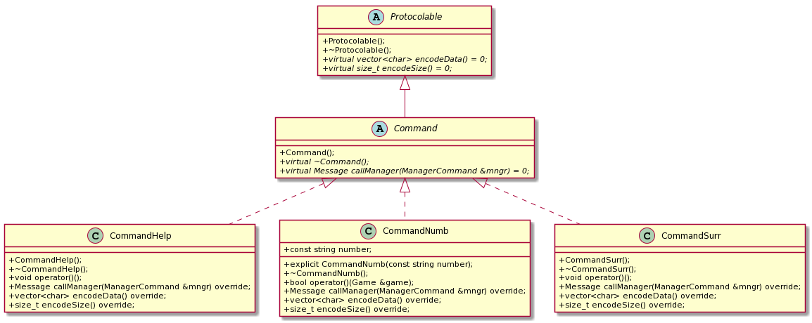
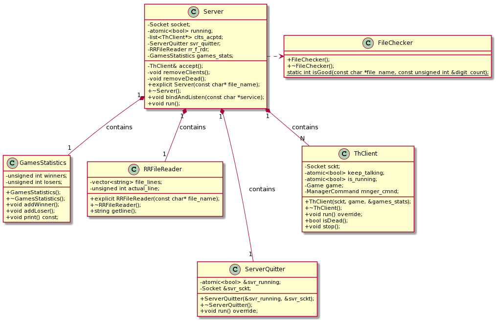
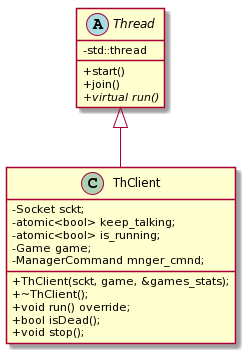
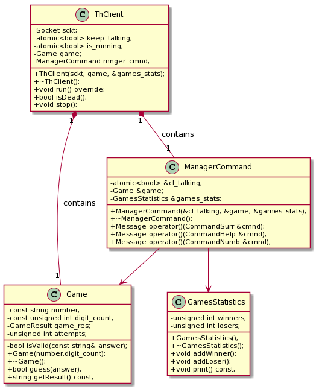
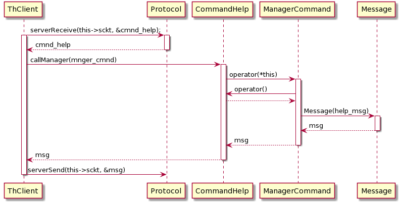

# <u>Trabajo Práctico 3</u>

Alumno: Franco Daniel Schischlo

Padrón: 100615

Repositorio: https://github.com/gdbien/tp3

## <u>Tabla de contenidos</u>
* [Descripción general](#desc)
* [Diagramas UML](#diag)

## <u>Descripción general</u>

Si bien este trabajo práctico no tenía muchas dificultades en cuanto a lógica, y era más una cuestión de combinar los conocimientos de sockets y theading, voy a realizar una descripción general de las clases más importantes.

`FactoryCommand`:  Crea los distintos comandos a partir de la línea levantada desde std::cin, del lado del cliente. No tiene estado y tiene métodos estáticos, con lo que puede ser utilizada sin una instancia.

`Protocol`: Codifica/Decodifica los mensajes enviados/recibidos entre el cliente y el servidor. Al igual que FactoryCommand, se la utiliza sin una instancia.

`Protocolable`: Es una interfaz que deben implementar todos los mensajes/comandos que quieren ser enviados por Protocolo.

`Command*`: Para encapsular la distinta lógica de cada comando (CommandSurr, CommandHelp y CommandNumb).

`NumberChecker`: Chequea si el numero es válido (que no tenga repetidos, y que su rango sea el correspondiente para la cantidad de dígitos del juego, que en este caso es 3). Es utilizada del lado del servidor, en FileChecker, y dentro de Game.

`ManagerCommand`: Ejecuta los comandos recibidos, y se encarga de crear los mensajes correspondientes para ser enviados al cliente (del lado del servidor).

`Game`: Contiene toda la lógica del juego de números (utiliza clase auxiliar GameResult).

`ThClient`: Representa un cliente (jugador) del lado del servidor. Hereda de Thread para que el servidor pueda comunicarse de forma concurrente con los distintos clientes. Contiene un Game y un ManagerCommand, para poder interactuar con los comandos que envia el cliente (lado cliente).

`ServerQuitter`: Lee constantemente desde std::cin un caracter, y si este es igual a 'q', hace que el Server termine su ejecución de forma ordenada, liberando sus recursos, y los de sus clientes conectados.

`RRFileReader`: Se encarga de leer un archivo en forma de Round-Robin.

Muchas clases fueron pensadas con genericidad, para que puedan ser reutilizadas, sin tener que aplicar grandes cambios.

Ejemplos:

1) `Game`: Si se quisiese cambiar la cantidad de dígitos del juego, solo debe modificarse el parametro digit_count al momento de crearse.

2) `Protocolo`: Si en un futuro yo quiero mandar por protocolo otras cosas que no sean mensajes/comandos, es tan simple como que el objeto a mandar implemente la interfaz Protocolable, la cual obliga a la clase a definir 2 métodos, uno que devuelve su representacion en bytes, y otro que devuelve el size de la representación.

## <u>Diagramas UML</u>

### <u>Diagramas de clase</u>

***Comandos***

***Server***

***ThClient : 1***

***ThClient : 2***

### <u>Diagramas de secuencia</u>

***ThClient*** : (ciclo de recepción del CommandHelp, con su ejecución y respuesta)

